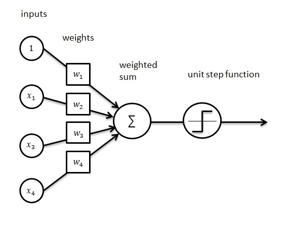

#Programando un Perceptrón Por las Piedritas

En éste ejercicio estaré buscando prorgamar un perceptrón con una función de activación logística. La estructura básica del perceptrón será como se muestra en la siguiente figura:

<center></center>

<!--<center></center> -->
<!--<center></center>-->


La fórmula de la función de activación logística:

$$y = \frac{1}{1+e^{-\theta^{T} x}}$$

##Base de datos para éste ejercicio

Estaré utilizando la base de datos `Iris` para éste ejercicio:
```{r, fig.align='center'}
head(iris)
```
Contiene 150 entradas con 4 *features* y 1 variable objetivo (especie de la planta).

##Preparación de los datos para uso del perceptrón

###Selección y preparacion de subconjunto de datos
```{r}
library(pracma)
o <- matrix(c(0.25,0.32,0.30,0.28), ncol = 4, nrow = 1) #pesos expresados como una matriz de 1x4.

  
x <-as.matrix(iris[,1:4]) #Conviertiendo los datos de Iris a matriz y excluyendo la variable objetivo.
ot <- t(o)
```

##Implementación
```{r echo=TRUE}
start.time <- Sys.time()

fun <- function(o,x) {
  y <- 1/(1+exp(x[,1:4] %*% t(o)))
time.taken <- Sys.time() - start.time

{cat("Proceso terminado en: ", time.taken, "milisegundos.")}

y
}
```


##Explorando resultados de $h_{\theta}(x)$
```{r}
a <- fun(o,x) #ejecutando la función con los datos de Iris.

res <- as.data.frame(cbind(a,iris[,5])) #data.frame que contiene los valores resultado de la función de activación del perceptrón y el valor de la variable objetivo en la base de datos Iris.
```

###Resultados en tabla
```{r echo=TRUE, fig.align='center'}
colnames(res) <- c("Perceptrón", "Etiqueta")
head(res)
```

###Boxplots

```{r, fig.align='center'}
library(reshape2)
library(ggplot2)


testMelt <- melt(res, id.var = "Etiqueta")
testMelt$Etiqueta <- as.factor(testMelt$Etiqueta)

g <- ggplot(testMelt,
       aes(x = variable, y = value)) +
  geom_boxplot(aes(fill = Etiqueta)) +
  labs(title = "Valores Provistos por Perceptrón por Etiqueta en Base de Datos IRIS",
       x = "Valores",
       y = "Grupos",
       caption = "Valores obtenidos de un perceptrón con una función de activación logística.")
g 

```

Derivado de éstas visualizaciones se decide tomar los siguientes valores como corte para la clasificación de los grupos:

 - Etiqueta 1: **$\geq$ 0.38**
 - Etiqueta 2: **<0.038 & >=0.014**
 - Etiqueta 3: **$\leq$ 0.013**

###Clasificación con parámetros calculados

Se realizará una clasificación de los resultados obtendios por el perceptrón en función a los valores indicados en el párrafo anterior, posteriormente éstos valores se asignarán a un vector `clas` que será agregado a la base de datos `IRIS`.
```{r, fig.align='center'}

clas<-c()
for(k in 1:dim(a)[1]){
  if(a[k,1]<=0.013)
    clas[k]<-3
  else if(a[k,1]>0.013 & a[k,1]<=0.038)
    clas[k]<-2
  else
    clas[k]<-1
}

resTable<-cbind.data.frame(iris,perceptron=a[,1],clasPercept = clas)
perform <- mean(as.numeric(resTable$Species)==resTable$clas)

head(resTable)
```

###Visualización de Clasificación
```{r, fig.align='center'}
colors <- c("#3498DB", "#F7DC6F", "#82E0AA")
resTable$clasPercept <- as.factor(resTable$clasPercept)

plot(resTable$perceptron,
     col = colors[resTable$clasPercept],
     pch = 19,
     xlab = "Instancias",
     ylab = "Valores",
     main = "Clasificación Final por el Perceptrón")
legend("topright",
       legend = c("Setosa","Versicolor", "Virginica"),
       fill = c("#3498DB", "#F7DC6F", "#82E0AA"))


```

<center>


**Con los resultados obtenidos en ésta tabla podemos apreciar que el perceptrón tiene un porcentaje de acierto de `r perform`.** 

</center>

