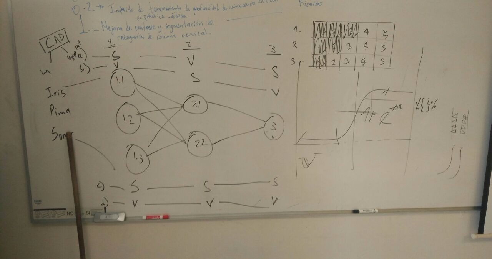

#Red Neuronal Sin Retropropagación

Para motivos de éste ejercicio se estará utilizando una estructura de red neuronal como lo indica la imagen que sigue:

<center></center>

##Cargando y preparando datos a utilizar
```{r cargaDatos, include=FALSE}
library(mlbench)
#Cargando
data("PimaIndiansDiabetes")
pima <- PimaIndiansDiabetes
rm(PimaIndiansDiabetes)
#pima <- pima[1:150,c(1:4,9)]

#Preparando
pimam <- as.matrix(pima[,-9])
pimam <- scale(pimam)
```

##Preparando pesos
```{r}
o0 <-matrix(c(0.5,0.1,1,0.8,0.4,0.6,0.7,0.2), ncol = 8, nrow = 1)
#o0 <-matrix(c(0.25,0.32,0.30,0.28,0.26,0.35,0.30,0.22), ncol = 8, nrow = 1)
o1 <-matrix(o0[,-4:-9], nrow = 1, ncol = 3)
o2 <-matrix(o1[,-1], nrow = 1, ncol = 2)
```

##Construyendo la red

###Capa de acceso de los datos (3 perceptrones)

Para ésta capa estaremos utilizando los pesos en la matríz $o0$ y los valores proporcionados por la base de datos `pima`.
```{r}
source("funciones.R")

## 3.0

p1.1 <- perceptron(pimam,o0,"s2")
p1.2 <- perceptron(pimam,o0,"s3")
p1.3 <- perceptron(pimam,o0,"s4")

red3.0 <- matrix(c(as.vector(p1.1), as.vector(p1.2), as.vector(p1.3)), nrow = 768, ncol = 3)
```

###Capa intermedia (2 perceptrones)

Para ésta capa estaremos utilizando los pesos en la matriz $o1$ y los valores en la matriz `red3.0` producto de la capa de entrada de datos.
```{r}
library(pracma)

##3.1
p2.1 <-perceptron(red3.0,o1,"s1")
p2.2 <- perceptron(red3.0,o1,"s2")

red3.1 <- matrix(c(as.vector(p2.1), as.vector(p2.2)), nrow = 768, ncol = 2)
```

##Capa de salida (1 perceptrón)

Para ésta capa estaremos utilizando los pesos en la matriz $o2$ y los valores en la matriz `red3.1`, producto de la capa oculta en la red neuronal artificial.
```{r}
#3.2
p3.2 <- perceptron(red3.1, o2, "s4")
```

##Visualización
```{r}
colors <- c("#e5b020", "#c9266a")

resANN <- as.data.frame(cbind(p3.2,pima[,9]))
plot(resANN$V1,
     col = colors[resANN$V2],
     pch = 19,
     xlab = "Instancias",
     ylab = "Valores",
     main = "Resultados Finales ANN")
```
<!--## Para cerrar

  - **Describir las características que tienen los datos.**
    - **Realizar análisis de base de datos PIMA.**
    - **Quedarme en bases de datos biomédicas.**
  -** Cómo se comportan los datos si utilizamos función V-Shaped.**
  - **Desde la perspectiva del análisis de datos: qué caractersíticas tienen los datos y cómo se comportan o comportarán una vez que se le aplica una función de cierto tipo.**
  - proponer una aproximación inspirad en el paper para analizar funciones de activación en bases de datos de la literatura.
  - Agregar una clasificación con datos de la American Diabetes Association (>126 mg/dL).
  - Seleccionar bases de datos médicas y describirlas a detalle, la dinámica de los datos y cómo se comportan al meterlas al trabajo. Reportarlo como un algoritmo (por pasos). ASegurarme que hay base de datos de imágenes médicas.-->

  
